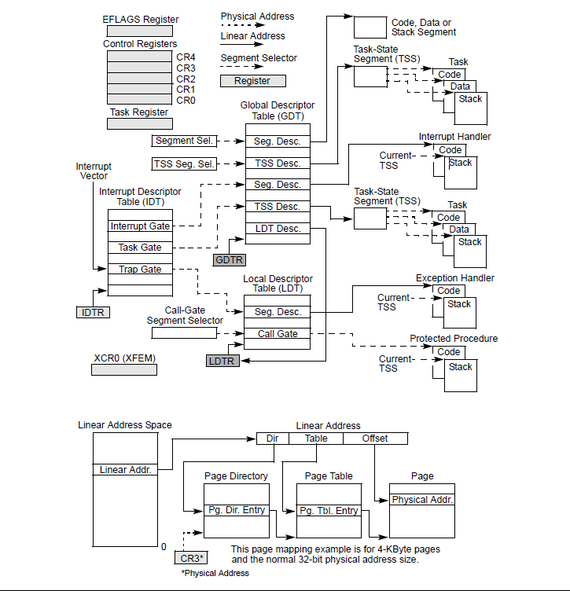
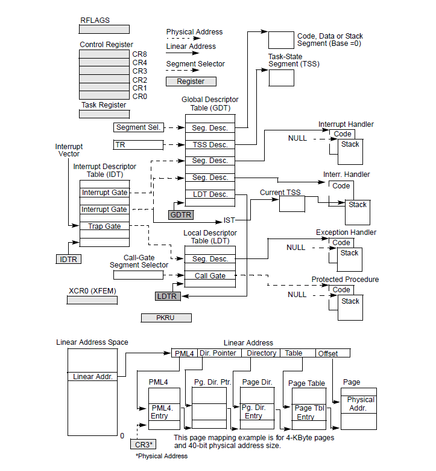

### PSW

```
+-+-+-+-+ +-+-+-+-+ +-------+ +-+-+-+-+ +---+---+ +-------+ +-+-+-+-+ +-+-+-+-|0|R|0|0|
|0|T|I|E| |PSW    | |1|M|W|P| |AS |CC | | Pgm   | |0|0|0|0| |0|0|0|0| | | | | | | | | |
|Key    | | | | | | |   |   | | Mask  | | | | | | | | | |+-+-+-+-+ +-+-+-+-+ +-------+ +-
+-+-+-+ +---+---+ +-------+ +-+-+-+-+ +-+-+-+- 0 0 0 0   0 0 0 0   0 0 1 1   1 1 1 1   1
1 1 1   2 2 2 2   2 2 2 2   2 2 3 3 0 1 2 3   4 5 6 7   8 9 0 1   2 3 4 5   6 7 8 9   0 1
2 3   4 5 6 7   8 9 0 1
```

```
00-00 Always 0 
01-01 (R) Program event recording mask 
02-04 Always 0 
05-05 (T) DAT mode T=1 
06-06 (I) Input/Output mask 
07-07 (E) External mask 
08-11 PSW key 
12-12 Architecture       
	0 - indicates z/Architecture       
	1 - indicates ESA/390 
13-13 (M) Machine check mask 
14-14 (W) Wait state W=1 
15-15 (P) Problem state P=1 
16-17 (AS) Address Space control       
	xx Real mode            T=0       
	00 Primary space mode   T=1       
	01 Access register mode T=1       
	10 Secondary space mode T=1       
	11 Home space mode      T=1 
18-19 (CC) Condition Code 20-23 Program mask       
20 Fixed point overflow mask       
21 Decimal overflow mask       
22 Exponent underflow mask       
23 Significance mask 
24-30 Always 0 
31-32 Extended/basic addressing mode       
	00 24-bit mode       
	01 31-bit mode       
	10 Invalid       
	11 64-bit mode
```

### FLAGS register

|                                                              |                             |              |                                                              |          |                      |                        |
| :----------------------------------------------------------: | :-------------------------: | :----------: | :----------------------------------------------------------: | :------: | :------------------: | :--------------------: |
| Intel x86 FLAGS register[[1\]](https://en.wikipedia.org/wiki/FLAGS_register#cite_note-1) |                             |              |                                                              |          |                      |                        |
|                            Bit #                             |            Mask             | Abbreviation |                         Description                          | Category |          =1          |           =0           |
|                            FLAGS                             |                             |              |                                                              |          |                      |                        |
|                              0                               |           0x0001            |      CF      |    [Carry flag](https://en.wikipedia.org/wiki/Carry_flag)    |  Status  |      CY(Carry)       |      NC(No Carry)      |
|                              1                               |           0x0002            |              | Reserved, always 1 in **EFLAGS** [[2\]](https://en.wikipedia.org/wiki/FLAGS_register#cite_note-2)[[3\]](https://en.wikipedia.org/wiki/FLAGS_register#cite_note-r8085-3) |          |                      |                        |
|                              2                               |           0x0004            |      PF      |   [Parity flag](https://en.wikipedia.org/wiki/Parity_flag)   |  Status  |   PE(Parity Even)    |     PO(Parity Odd)     |
|                              3                               |           0x0008            |              | Reserved[[3\]](https://en.wikipedia.org/wiki/FLAGS_register#cite_note-r8085-3) |          |                      |                        |
|                              4                               |           0x0010            |      AF      |   [Adjust flag](https://en.wikipedia.org/wiki/Adjust_flag)   |  Status  | AC(Auxiliary Carry)  | NA(No Auxiliary Carry) |
|                              5                               |           0x0020            |              | Reserved[[3\]](https://en.wikipedia.org/wiki/FLAGS_register#cite_note-r8085-3) |          |                      |                        |
|                              6                               |           0x0040            |      ZF      |     [Zero flag](https://en.wikipedia.org/wiki/Zero_flag)     |  Status  |       ZR(Zero)       |      NZ(Not Zero)      |
|                              7                               |           0x0080            |      SF      |     [Sign flag](https://en.wikipedia.org/wiki/Sign_flag)     |  Status  |     NG(Negative)     |      PL(Positive)      |
|                              8                               |           0x0100            |      TF      | [Trap flag](https://en.wikipedia.org/wiki/Trap_flag) (single step) | Control  |                      |                        |
|                              9                               |           0x0200            |      IF      | [Interrupt enable flag](https://en.wikipedia.org/wiki/IF_(x86_flag)) | Control  | EI(Enable Interrupt) | DI(Disable Interrupt)  |
|                              10                              |           0x0400            |      DF      | [Direction flag](https://en.wikipedia.org/wiki/Direction_flag) | Control  |       DN(Down)       |         UP(Up)         |
|                              11                              |           0x0800            |      OF      | [Overflow flag](https://en.wikipedia.org/wiki/Overflow_flag) |  Status  |     OV(Overflow)     |    NV(Not Overflow)    |
|                            12-13                             |           0x3000            |     IOPL     | [I/O privilege level](https://en.wikipedia.org/wiki/IOPL) (286+ only), always 1[*clarification needed*] on 8086 and 186 |  System  |                      |                        |
|                              14                              |           0x4000            |      NT      |    Nested task flag (286+ only), always 1 on 8086 and 186    |  System  |                      |                        |
|                              15                              |           0x8000            |              | Reserved, always 1 on 8086 and 186, always 0 on later models |          |                      |                        |
|                            EFLAGS                            |                             |              |                                                              |          |                      |                        |
|                              16                              |         0x0001 0000         |      RF      | [Resume flag](https://en.wikipedia.org/w/index.php?title=Resume_flag&action=edit&redlink=1) (386+ only) |  System  |                      |                        |
|                              17                              |         0x0002 0000         |      VM      | [Virtual 8086 mode](https://en.wikipedia.org/wiki/Virtual_8086_mode) flag (386+ only) |  System  |                      |                        |
|                              18                              |         0x0004 0000         |      AC      |                Alignment check (486SX+ only)                 |  System  |                      |                        |
|                              19                              |         0x0008 0000         |     VIF      |              Virtual interrupt flag (Pentium+)               |  System  |                      |                        |
|                              20                              |         0x0010 0000         |     VIP      |             Virtual interrupt pending (Pentium+)             |  System  |                      |                        |
|                              21                              |         0x0020 0000         |      ID      |           Able to use CPUID instruction (Pentium+)           |  System  |                      |                        |
|                            22-31                             |         0xFFC0 0000         |              |                           Reserved                           |  System  |                      |                        |
|                            RFLAGS                            |                             |              |                                                              |          |                      |                        |
|                            32-63                             | 0xFFFF FFFF... ...0000 0000 |              |                           Reserved                           |          |                      |                        |

### IA-32 System-Level Registers and Data Struction



### System-Level Registers and Data Structures in IA-32e Mode



